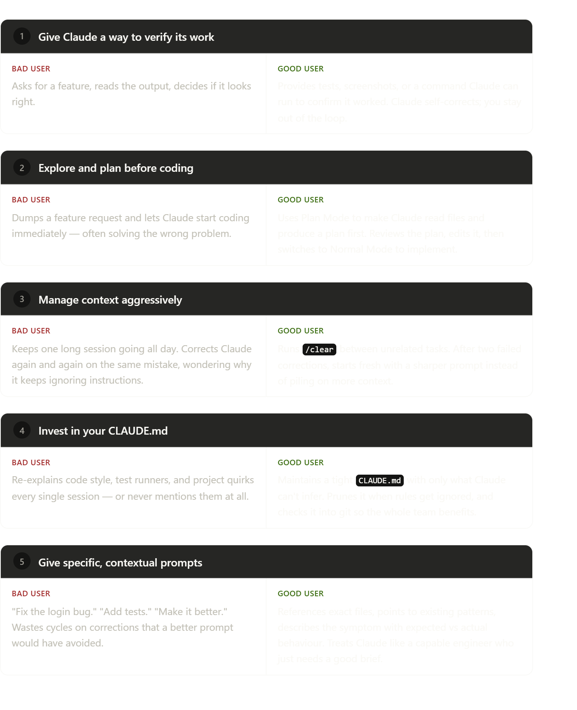

We have to change the presentation completely. the new presentation is called: "Thinking in Context"

The first slides will remain the current quiz but with the addtional words of "needle-in-a-haystack" and "Glob & Grep".

Slide one after the quiz is called Why Today's sharing Session was so difficult to prepare!
Thinking of AI topics that remain relevant for more than 1 week is very difficult. Topics come in and out of fashion so quickly it's impossible to keep track of (->here we will insert the uncool gif, example - Talking aboutn Prompt Engineering is UNCOOL).
The goal of today's sharing session is to start a series of topics that _should_ remain importnatn for at least the rest of the year (->this is a joke) the topics should be relevant mid-long termand generally are considered best practircres. The topcis we will touch upon in this series are

Context (today)
Ai Harnesses
Security 
Long Horizon Tasks
???

-> these topics could be represented in some sort of box, or learning path, can you think of other topics thatr are "AI EVERGREEN?".

Slied 2 can start with this sentence:
To get the most out of AI tools (i.e. Claude Code, GPT Codex) we must be..... -> reveal "Thinking in Context"
---> insert the I like the way you are thinking gif

What does that mean? -> it meas we must treat context as a finite resource, we must take care of the context:
Prompt Engienering is how we talked to Gemini
Context Engineering is how we talk to Claude Code

Slide 3 
-> i want to add the prompt vs engieering slide but redone in the syle of the slides, it can be exactly the same but you have to make it from scratch in the presentation and not use the actual image.
--> and we will add a summarixe version of this: Despite their speed and ability to manage larger and larger volumes of data, we’ve observed that LLMs, like humans, lose focus or experience confusion at a certain point. Studies on needle-in-a-haystack style benchmarking have uncovered the concept of context rot: as the number of tokens in the context window increases, the model’s ability to accurately recall information from that context decreases.

While some models exhibit more gentle degradation than others, this characteristic emerges across all models. Context, therefore, must be treated as a finite resource with diminishing marginal returns. Like humans, who have limited working memory capacity, LLMs have an “attention budget” that they draw on when parsing large volumes of context. Every new token introduced depletes this budget by some amount, increasing the need to carefully curate the tokens available to the LLM.

Slide 4

A summarized version of this:
Context engineering for long-horizon tasks
Long-horizon tasks require agents to maintain coherence, context, and goal-directed behavior over sequences of actions where the token count exceeds the LLM’s context window. For tasks that span tens of minutes to multiple hours of continuous work, like large codebase migrations or comprehensive research projects, agents require specialized techniques to work around the context window size limitation.

Waiting for larger context windows might seem like an obvious tactic. But it's likely that for the foreseeable future, context windows of all sizes will be subject to context pollution and information relevance concerns—at least for situations where the strongest agent performance is desired. To enable agents to work effectively across extended time horizons, we've developed a few techniques that address these context pollution constraints directly: compaction, structured note-taking, and multi-agent architectures.

Compaction

Compaction is the practice of taking a conversation nearing the context window limit, summarizing its contents, and reinitiating a new context window with the summary. Compaction typically serves as the first lever in context engineering to drive better long-term coherence. At its core, compaction distills the contents of a context window in a high-fidelity manner, enabling the agent to continue with minimal performance degradation.

In Claude Code, for example, we implement this by passing the message history to the model to summarize and compress the most critical details. The model preserves architectural decisions, unresolved bugs, and implementation details while discarding redundant tool outputs or messages. The agent can then continue with this compressed context plus the five most recently accessed files. Users get continuity without worrying about context window limitations.

The art of compaction lies in the selection of what to keep versus what to discard, as overly aggressive compaction can result in the loss of subtle but critical context whose importance only becomes apparent later. For engineers implementing compaction systems, we recommend carefully tuning your prompt on complex agent traces. Start by maximizing recall to ensure your compaction prompt captures every relevant piece of information from the trace, then iterate to improve precision by eliminating superfluous content.

An example of low-hanging superfluous content is clearing tool calls and results – once a tool has been called deep in the message history, why would the agent need to see the raw result again? One of the safest lightest touch forms of compaction is tool result clearing, most recently launched as a feature on the Claude Developer Platform.

Structured note-taking

Structured note-taking, or agentic memory, is a technique where the agent regularly writes notes persisted to memory outside of the context window. These notes get pulled back into the context window at later times.

This strategy provides persistent memory with minimal overhead. Like Claude Code creating a to-do list, or your custom agent maintaining a NOTES.md file, this simple pattern allows the agent to track progress across complex tasks, maintaining critical context and dependencies that would otherwise be lost across dozens of tool calls.

Claude playing Pokémon demonstrates how memory transforms agent capabilities in non-coding domains. The agent maintains precise tallies across thousands of game steps—tracking objectives like "for the last 1,234 steps I've been training my Pokémon in Route 1, Pikachu has gained 8 levels toward the target of 10." Without any prompting about memory structure, it develops maps of explored regions, remembers which key achievements it has unlocked, and maintains strategic notes of combat strategies that help it learn which attacks work best against different opponents.

After context resets, the agent reads its own notes and continues multi-hour training sequences or dungeon explorations. This coherence across summarization steps enables long-horizon strategies that would be impossible when keeping all the information in the LLM’s context window alone.

As part of our Sonnet 4.5 launch, we released a memory tool in public beta on the Claude Developer Platform that makes it easier to store and consult information outside the context window through a file-based system. This allows agents to build up knowledge bases over time, maintain project state across sessions, and reference previous work without keeping everything in context.

Sub-agent architectures

Sub-agent architectures provide another way around context limitations. Rather than one agent attempting to maintain state across an entire project, specialized sub-agents can handle focused tasks with clean context windows. The main agent coordinates with a high-level plan while subagents perform deep technical work or use tools to find relevant information. Each subagent might explore extensively, using tens of thousands of tokens or more, but returns only a condensed, distilled summary of its work (often 1,000-2,000 tokens).

This approach achieves a clear separation of concerns—the detailed search context remains isolated within sub-agents, while the lead agent focuses on synthesizing and analyzing the results. This pattern, discussed in How we built our multi-agent research system, showed a substantial improvement over single-agent systems on complex research tasks.

The choice between these approaches depends on task characteristics. For example:

Compaction maintains conversational flow for tasks requiring extensive back-and-forth;
Note-taking excels for iterative development with clear milestones;
Multi-agent architectures handle complex research and analysis where parallel exploration pays dividends.
Even as models continue to improve, the challenge of maintaining coherence across extended interactions will remain central to building more effective agents.

were comapction and multi agent arcthitectures is 100% dealt with by Claude Code itself: your added value will mostly be in Note Taking: you chose what claude needs to remeber between multiple sessions, where you want to start where you want to develop in that session. 

Slide 5:

The through-line across all five: **Claude's performance degrades with bad inputs and recovers with good ones.** The tool is the same — the variable is the user. A good user closes feedback loops early (verification), avoids wasted work (planning), keeps the workspace clean (context), maintains persistent config (CLAUDE.md), and communicates like a senior engineer giving a brief (specific prompts).